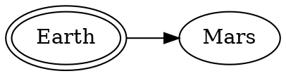

# The attack plan





# PlantUML Samples

```plantuml classes="uml myDiagram" alt="Diagram placeholder" title="My diagram"
@startuml
  Goofy ->  MickeyMouse: calls
  Goofy <-- MickeyMouse: responds
@enduml
```