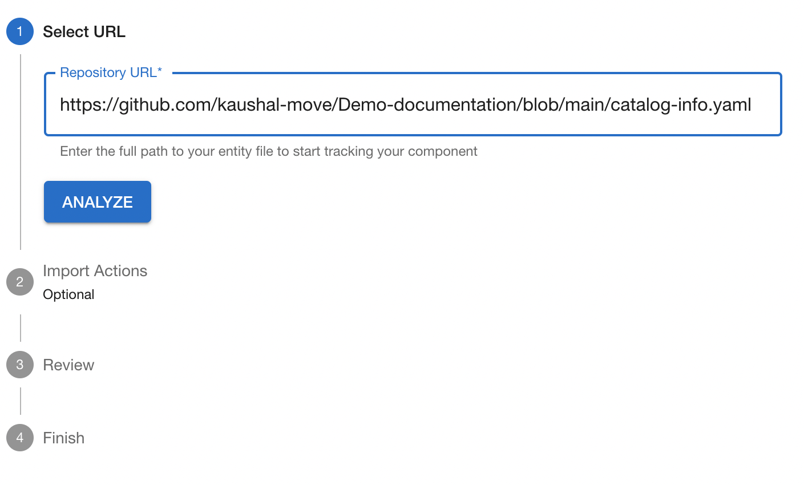
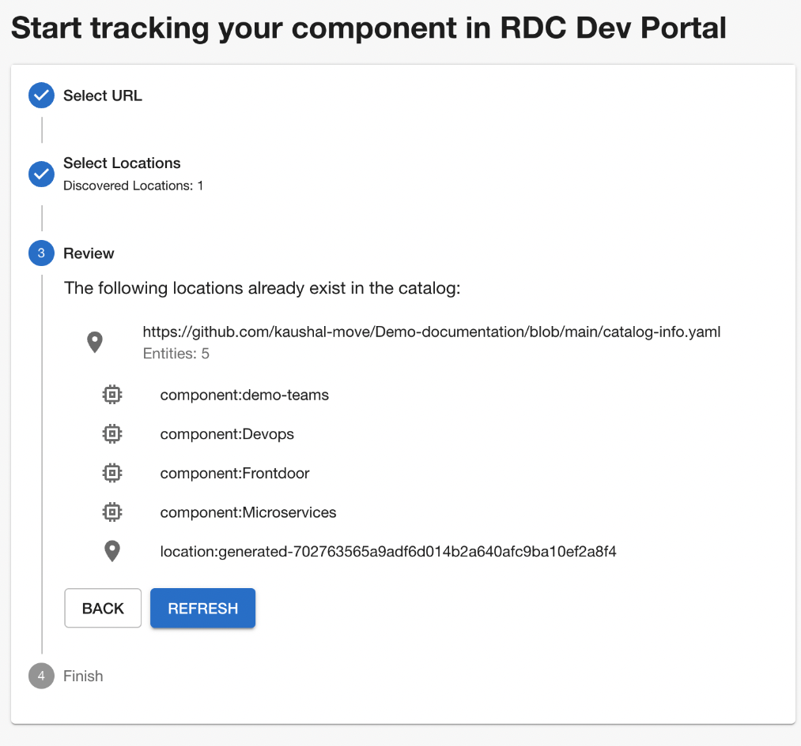

# Developer Portal
## Why Developer Portal

- Current Pipelines - Mark tool sync markdowns to confluence.
- Problems with Mark tool: No delete and move, Clumsy Header and Poor handling of relative links
- Docs as code, no need for confluence pipelines or mkdocs website
- Centralizing all the documentation, great for search
- Feedback loop
- Uses Mkdocs
- Trust/Information Card
- Ownership

## Integration





## Our workflow

- https://github.com/kaushal-move/Demo-documentation/blob/main/catalog-info.yaml
- https://github.com/kaushal-move/Demo-documentation/blob/sandbox/catalog-info.yaml

```plantuml classes="uml myDiagram" alt="Diagram placeholder" title="My diagram"
@startuml
Developer -> GitSandbox: Push changes to SandBox

GitSandbox ----> DevPortalQA: QA dev portal syncs changes from sandbox

Developer -> DevPortalQA: Verifies changes on Sandbox

Developer --> GitMaster: Creates MR on Master with references of QA docs

GitMaster -> DevPortalQA: Pord Portal Syncs the changes

@enduml
```

- You can also have different catalog file for both prod and sandbox that way you have more control over documentation.
  - https://github.com/kaushal-move/Demo-documentation/blob/main/catalog-info-sandbox.yaml
  - https://github.com/kaushal-move/Demo-documentation/blob/sandbox/catalog-info-prod.yaml
  ```
  apiVersion: backstage.io/v1alpha1
  kind: Component
  metadata:
    name: demo-teams
    description: demo
    annotations:
      backstage.io/techdocs-ref: dir:./
  spec:
    type: documentation
    owner: microservice
    lifecycle: Production
  ```

- Compile your TechDocs locally and you don't need Sandbox.

## Demo

### Search Capability
### Components
- How can you create sub components?
- Ownership and segregation of responsibility
### Feedback Loop

#### Issues
Winter is coming!!

NOTE: Need to enable Issues in repo.

#### Inline Changes
Update this line

### Diagrams as Code
#### The Graphviz Sample



#### PlantUML Samples

```plantuml classes="uml myDiagram" alt="Diagram placeholder" title="My diagram"
@startuml
group TCP-Handshake
  Client  -> Server: <b>syn</b> seq=x
  Client <-- Server: <b>syn</b> ack=x+1 seq=y
  Client  -> Server: <b>ack</b>=y+1 seq=x+1
  Client  -> Server: [data]
end
@enduml
```
